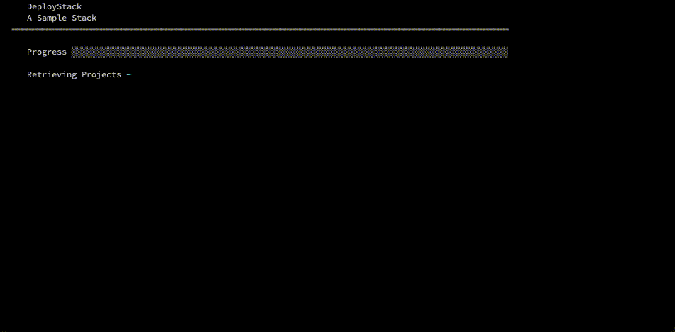
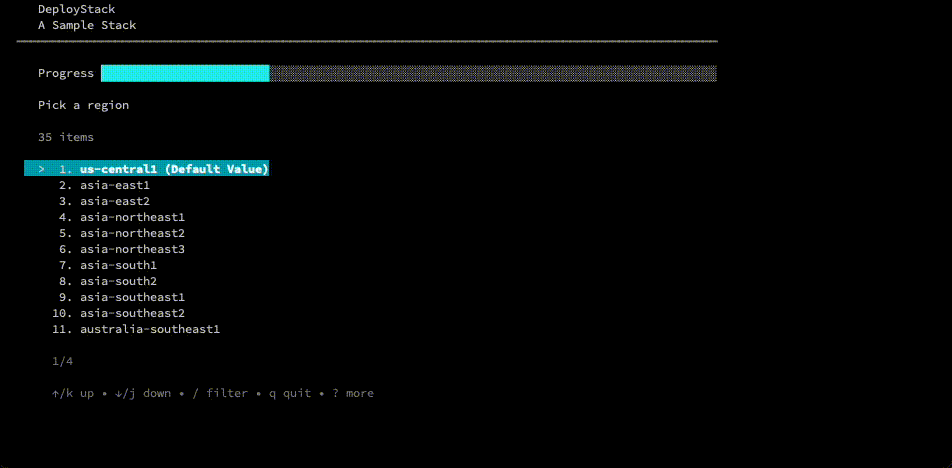
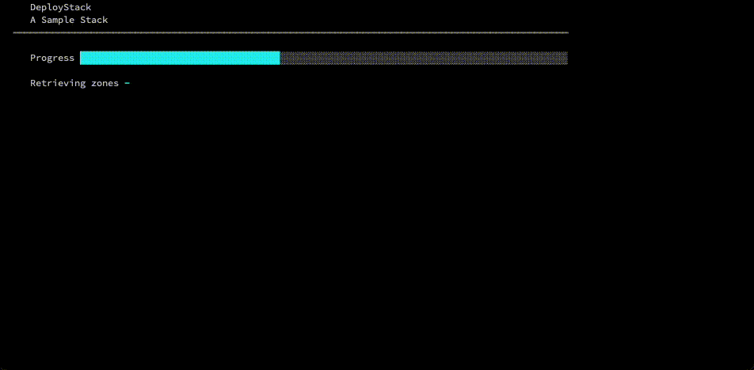
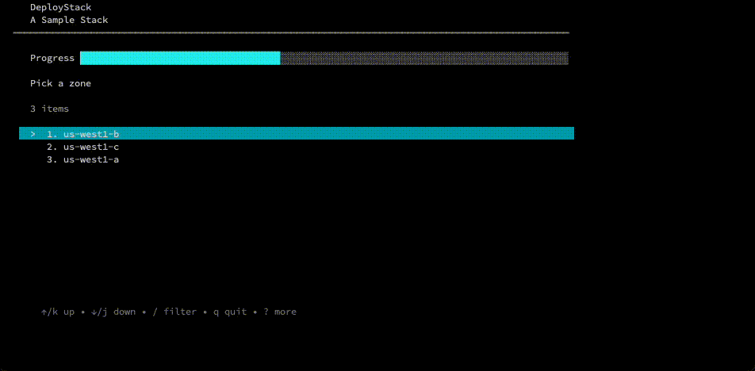

# DeployStack
[](https://godoc.org/github.com/GoogleCloudPlatform/deploystack)

This project is to centralize all of the tools and processes to get terminal
interfaces for collecting information from users for use with DeployStack.

## Authoring

### TLDR;

Quick TLDR omitting testing, which you should totally do but for development and
whatnot you can just do this.

1. Create a Folder to hold your stack.
1. Add your `main.tf` file
1. Create a .deploystack folder
1. Add a `deploystack.yaml` file

Running `./deploystack install` should spin up the goapp and collect the config items the
stack needs to run through the deployment

Running `./deploystack uninstall` will destory the whole thing.

### Details

Authors are required to make or edit 4 files.

- `main.tf`
- `.deploystack/deploystack.yaml`
- `.deploystack/test`


### `main.tf`

This is a standard terraform file with one adjustment for the DeployStack setup.
These files should have several import variables setup with the idea that the
golang helper will get them from the user.

```javascript
variable "project_id" {
  type = string
}

variable "project_number" {
  type = string
}

variable "region" {
  type = string
}

variable "zone" {
  type = string
}
```

### `deploystack.yaml`

This config will be read by the golang helper to prompt the user to create a
tfvars file that will drive the terraform script.

```yaml
title: Basic Title
duration: 5
collect_project: true
collect_region: true
region_type: functions
region_default: us-central1
collect_zone: true
hard_settings:
  basename: appprefix
custom_settings:
- name: nodes
  description: Please enter the number of nodes
  options:
  - roles/reviewer|Project Reviewer
  - roles/owner|Project Owner
  - roles/vison.reader|Cloud Vision Reader
  default: roles/owner|Project Owner
projects:
  allow_duplicates: false
  items:
  - variable_name: project_id
    user_prompt: Choose a project to use for this application
    set_as_default: true
  - variable_name: project_id_2
    user_prompt: Choose a second project to use for this application
    set_as_default: false
```

_JSON is also allowed _


#### DeployStack Config Settings


| Name                   | Type    | Description                                                                          |
| ---------------        | ------- | ------------------------------------------------------------------------------------ |
| title                  | string  | You know what a title is                                                             |
| duration               | number  | An estimate as to how long this installation takes                                   |
| description            | string  | A text explanation of the stack. Useful in yaml config, as it can contain formatting.|
| collect_project        | boolean | Whether or not to walk the user through picking or creating a project.               |
| collect_region         | boolean | Whether or not to walk the user through picking a regions                            |
| register_domain        | boolean | Whether or not to walk the user through registering a domain                         |
| configure_gce_instance | boolean | Whether or not to walk the user through configuring a compute engine instance        |
| region_type            | string  | Which product to select a region for                                                 |
|                        |         | Options: compute, run, functions                                                     |
| region_default         | string  | The highlighted and default choice for region.                                       |
| collect_zone           | string  | Whether or not to walk the user through picking a zone                               |
| hard_settings          |         | Hard Settings are for key value pairs to hardset and not get from the user.          |
|                        |         | `"basename":"appprefix"`                                                             |
| prepend_project        | bool    | Whether or not to prepend the project id to the default value. Useful for resources like buckets that have to have globally unique names.                       |
| path_terraform         | string  | Path that DeployStack should regard as the terraform folder.   |
| path_messages          | string  | Path that DeployStack should look for messages, description and success.   |
| path_scripts           | string  | Path that DeployStack should look for scripts that can be injected into DeployStack routine.  |
| custom_settings        |         |  **Documentation Below** Custom Settings are collections of settings that we would like to prompt a user for.  |
| projects               |         |  **Documentation Below** Projects are a list of projects with settings that will surface the project selector interface for.  |
| products               |         |  **Documentation Below** Products are a list of products or other labels for structured documentation  |

#### Custom Settings Options

| Name                   | Type    | Description                                                                          |
| ---------------        | ------- | ------------------------------------------------------------------------------------ |
| name                   | string  | The name of the variable                                                             |
| description            | string  | The description of the variable to prompt the user with                              |
| default                | string  | A default value for the variable.                                                    |
| options                | array   | An array of options to turn this into a custom select interface <br /> **Note** Optionally you can pass a \| to divide an option into a value and a label like so: <br /> `"weirdConfigSetting\|User Readable Label"`                     |


#### Projects Settings Options

| Name                   | Type    | Description                                                                          |
| ---------------        | ------- | ------------------------------------------------------------------------------------ |
| allow_duplicates       | bool    | Whether or not a user can use the same project multiple times, defaults to `false`   |

#### Project Settings Options

| Name                   | Type    | Description                                                                          |
| ---------------        | ------- | ------------------------------------------------------------------------------------ |
| variable_name          | string  | The name of the variable                                                             |
| user_prompt            | string  | The description of the variable to prompt the user with                              |
| set_as_default         | string  | Whether or not to set this as the default project for the user                       |


#### Product Settings Options

| Name                   | Type    | Description                                                                                |
| -------- | ------- | -------------------------------------------------------------------------------------------------------- |
| product  | string  | The name of a product or other label for part of a solution.  Used to add structured documentation.      |
| info     | string  | The description of the product or other label.                                                           |


### UI Controls

#### Header
```yaml
title: "A Sample Stack"
name: "sample"
duration: 9 
documentation_link: "https://cloud.google.com/shell/docs/cloud-shell-tutorials/deploystack"
products :
- info: "VM template" 
  product: "Instance Template"   
- info: "Clustering" 
  product: "Managed Instance Group"   
- info: "Load Balancing" 
  product: "Load Balancer"       
description:  | 
  This is additional stuff that will go here and be formatted. 
  * You can add a bullet list
  * That's totally cool
```


#### Project Selector
```yaml
collect_project: true
```


#### Region Selector
```yaml
collect_region: true
region_type: "run"
region_default: "us-central1"
```


#### Zone Selector
```yaml
collect_zone: true
```



#### Custom Settings - no options
```yaml
custom_settings:
  - name : "nodes"
    description: "Please enter the number of nodes"
    default: 3
```


#### Custom Settings - options
```yaml
custom_settings:
  - name : "nodes2"
    description: "Please enter the number of nodes"
    default: 3
    options: ["1", "2", "3"]
```


#### Domain Registration
```yaml
register_domain: truee
```



### `messages/description.txt`

DEPRECATED: This file allows you to add a formatted description to the configuration to
print out to the user. Json files don't do well with newlines. Using Description in
deploystack.yaml is now prefered

### `test`

Test is a shell script that tests the individual pieces of the infrastructure
and tests the desired state at the end of the install.

There are a few functions in the template test file that will help you run one
of these.

- `section_open` - a display function that hellps communicate what is going on.
- `section_close` - paired with section_open
- `evaltest` - take a gcloud command and a desired outcome to make test assertions

```bash
# Setup variables here
source globals
get_project_id PROJECT
get_project_number PROJECT_NUMBER $PROJECT
REGION=us-central1
ZONE=us-central1-a
BASENAME=basiclb
SIZE=3

# Make sure that project is hard set
gcloud config set project ${PROJECT}

# spin up terraform with variables plugged in to build the infrastructure
terraform init
terraform apply -auto-approve -var project_id="${PROJECT}" -var project_number="${PROJECT_NUMBER}" -var region="${REGION}" -var zone="${ZONE}" -var basename="${BASENAME}" -var nodes="${SIZE}"

# You might hace to do some editing here to make these tests work
section_open "Test Managed Instance Group"
    evalTest 'gcloud compute instance-groups managed describe $BASENAME-mig --zone $ZONE --format="value(name)"'  $BASENAME-mig

    COUNT=$(gcloud compute instances list --format="value(name)" | grep $BASENAME-mig | wc -l | xargs)

    if [ $COUNT -ne $SIZE ]
    then
        printf "Halting - error: expected $SIZE instances of GCE got $COUNT  \n"
        exit 1
    else
         printf "number of GCE instances is ok \n"
    fi

section_close

# But in a lot of cases we can just use eval test with a gcloud command and a
# desrired result.
section_open "Test Instance Template"
    evalTest 'gcloud compute instance-templates describe $BASENAME-template --format="value(name)"'  $BASENAME-template
section_close

..

# Now run a destroy operation.
terraform destroy -auto-approve -var project_id="${BASENAME}" -var project_number="${PROJECT_NUMBER}" -var region="${REGION}" -var zone="${ZONE}" -var basename="${BASENAME}" -var nodes="${SIZE}"

# Test all of the parts are destroyed
section_open "Test Managed Instance Group doesn't exist"
    evalTest 'gcloud compute instance-groups managed describe $BASENAME-mig --zone $ZONE --format="value(name)"'  "EXPECTERROR"
section_close

printf "$DIVIDER"
printf "CONGRATS!!!!!!! \n"
printf "You got the end the of your test with everything working. \n"
printf "$DIVIDER"
```


## Testing this Repo

In order to test the helper app in this repo, we need to do a fair amount of
manipulation of projects and what not. To faciliate that the tests require a
Service Account key json file. To faciliate this there is a script in
`tools/credsfile` that will create a service account, give it the right access
and service enablements, and export out a key file to use with testing.

This is not an offical Google product.
