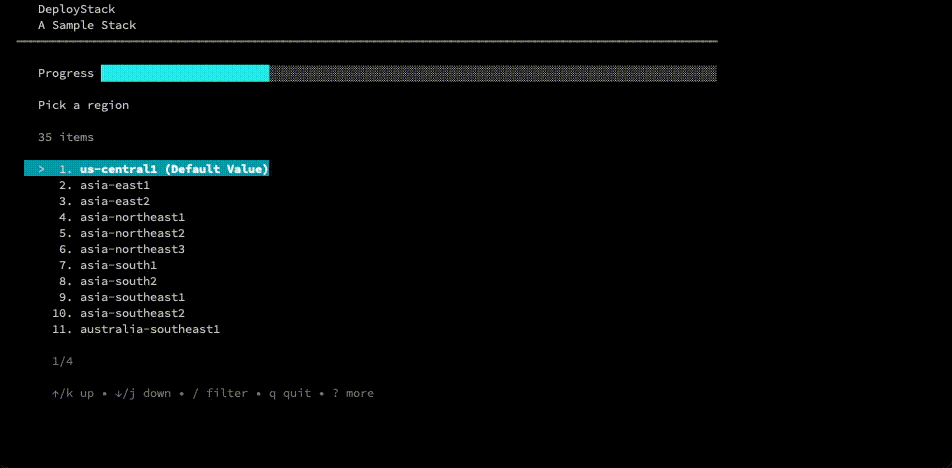
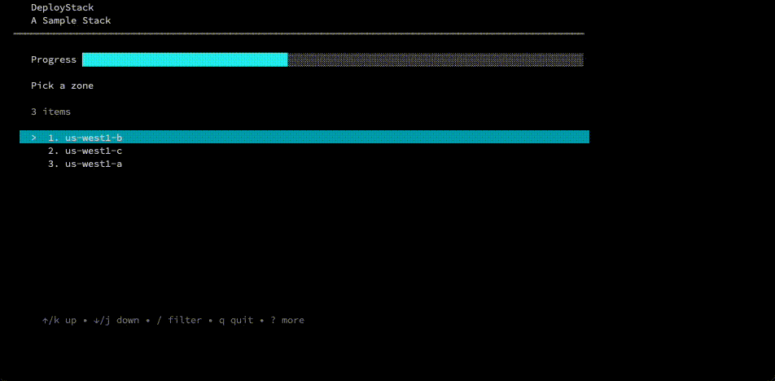

# deploystack/config
[](https://godoc.org/github.com/GoogleCloudPlatform/deploystack/config)

The subpackage manages all of the configuration details for DeployStack.

#### DeployStack Config Settings


| Name                   | Type    | Description                                                                          |
| ---------------        | ------- | ------------------------------------------------------------------------------------ |
| title                  | string  | You know what a title is                                                             |
| duration               | number  | An estimate as to how long this installation takes                                   |
| description            | string  | A text explanation of the stack. Useful in yaml config, as it can contain formatting.|
| collect_project        | boolean | Whether or not to walk the user through picking or creating a project.               |
| collect_region         | boolean | Whether or not to walk the user through picking a regions                            |
| register_domain        | boolean | Whether or not to walk the user through registering a domain                         |
| configure_gce_instance | boolean | Whether or not to walk the user through configuring a compute engine instance        |
| region_type            | string  | Which product to select a region for                                                 |
|                        |         | Options: compute, run, functions                                                     |
| region_default         | string  | The highlighted and default choice for region.                                       |
| collect_zone           | string  | Whether or not to walk the user through picking a zone                               |
| hard_settings          |         | Hard Settings are for key value pairs to hardset and not get from the user.          |
|                        |         | `"basename":"appprefix"`                                                             |
| prepend_project        | bool    | Whether or not to prepend the project id to the default value. Useful for resources like buckets that have to have globally unique names.                       |
| path_terraform         | string  | Path that DeployStack should regard as the terraform folder.   |
| path_messages          | string  | Path that DeployStack should look for messages, description and success.   |
| path_scripts           | string  | Path that DeployStack should look for scripts that can be injected into DeployStack routine.  |
| custom_settings        |         |  **Documentation Below** Custom Settings are collections of settings that we would like to prompt a user for.  |
| projects               |         |  **Documentation Below** Projects are a list of projects with settings that will surface the project selector interface for.  |
| products               |         |  **Documentation Below** Products are a list of products or other labels for structured documentation  |


#### Author Settings Options

| Name  | Type   | Description                                                                             |
|-------|--------|-----------------------------------------------------------------------------------------|
| name  | string | The name of the variable                                                                |
| value | string | The value of the varible as a string                                                    |
| type  | string | A Terraform type that will be set in the terraform.tfvars file when deploystack is done: string, number, bool, list, map  |


#### Custom Settings Options

| Name                   | Type    | Description                                                                          |
| ---------------        | ------- | ------------------------------------------------------------------------------------ |
| name                   | string  | The name of the variable                                                             |
| description            | string  | The description of the variable to prompt the user with                              |
| default                | string  | A default value for the variable.                                                    |
| options                | array   | An array of options to turn this into a custom select interface <br /> **Note** Optionally you can pass a \| to divide an option into a value and a label like so: <br /> `"weirdConfigSetting\|User Readable Label"`                     |


#### Projects Settings Options

| Name                   | Type    | Description                                                                          |
| ---------------        | ------- | ------------------------------------------------------------------------------------ |
| allow_duplicates       | bool    | Whether or not a user can use the same project multiple times, defaults to `false`   |

#### Project Settings Options

| Name                   | Type    | Description                                                                          |
| ---------------        | ------- | ------------------------------------------------------------------------------------ |
| variable_name          | string  | The name of the variable                                                             |
| user_prompt            | string  | The description of the variable to prompt the user with                              |
| set_as_default         | string  | Whether or not to set this as the default project for the user                       |


#### Product Settings Options

| Name    | Type   | Description                                                                                         |
|---------|--------|-----------------------------------------------------------------------------------------------------|
| product | string | The name of a product or other label for part of a solution.  Used to add structured documentation. |
| info    | string | The description of the product or other label.                                                      |


### UI Controls

#### Header
```yaml
title: "A Sample Stack"
name: "sample"
duration: 9 
documentation_link: "https://cloud.google.com/shell/docs/cloud-shell-tutorials/deploystack"
products :
- info: "VM template" 
  product: "Instance Template"   
- info: "Clustering" 
  product: "Managed Instance Group"   
- info: "Load Balancing" 
  product: "Load Balancer"       
description:  | 
  This is additional stuff that will go here and be formatted. 
  * You can add a bullet list
  * That's totally cool
```


#### Project Selector
```yaml
collect_project: true
```


#### Region Selector
```yaml
collect_region: true
region_type: "run"
region_default: "us-central1"
```


#### Zone Selector
```yaml
collect_zone: true
```


#### Custom Settings - no options
```yaml
custom_settings:
  - name : "nodes"
    description: "Please enter the number of nodes"
    default: 3
```


#### Custom Settings - options
```yaml
custom_settings:
  - name : "nodes2"
    description: "Please enter the number of nodes"
    default: 3
    options: ["1", "2", "3"]
```


#### Domain Registration
```yaml
register_domain: truee
```

