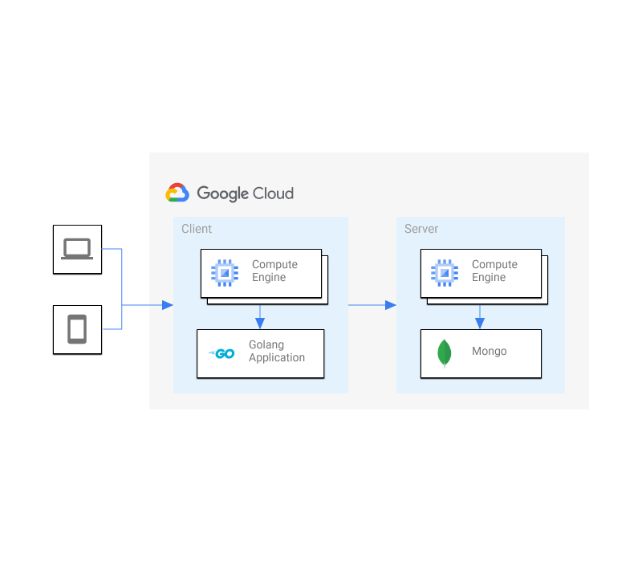

# Deploy Stack - NoSQL Client Server 

This stack creates two Compute Engine Instances, installs MongoDB on one, and 
an API that acts as a client for the database on the other. It connects them
together and sets up firewall rules to expose the API content publically.  

## Install
You can install this application using the `Open in Google Cloud Shell` button 
below. 

Clicking this link will take you right to the DeployStack app, running in your 
Cloud Shell environment. It will walk you through setting up your architecture.  

## Cleanup 
To remove all billing components from the project
1. Typing `deploystack uninstall`

This is not an official Google product.